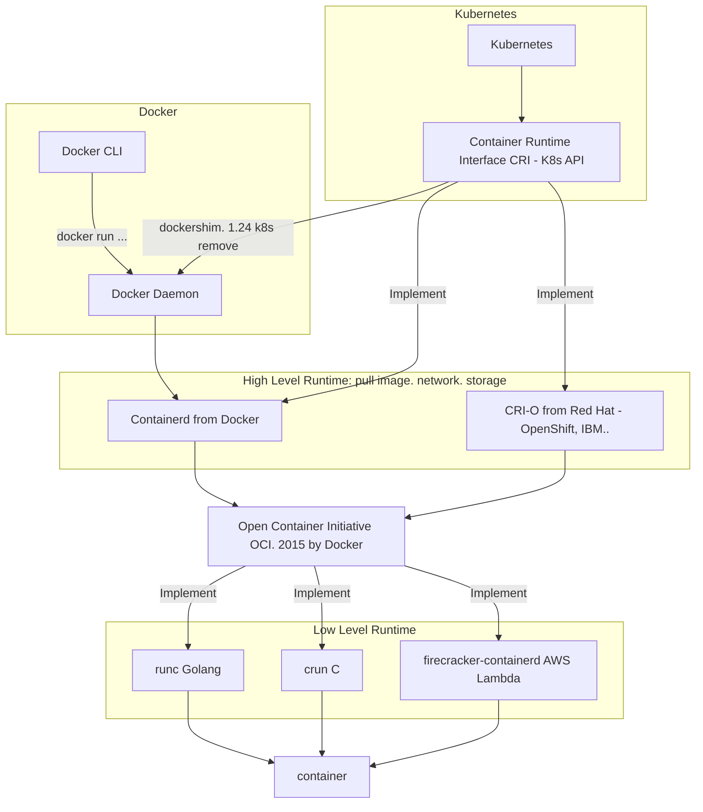
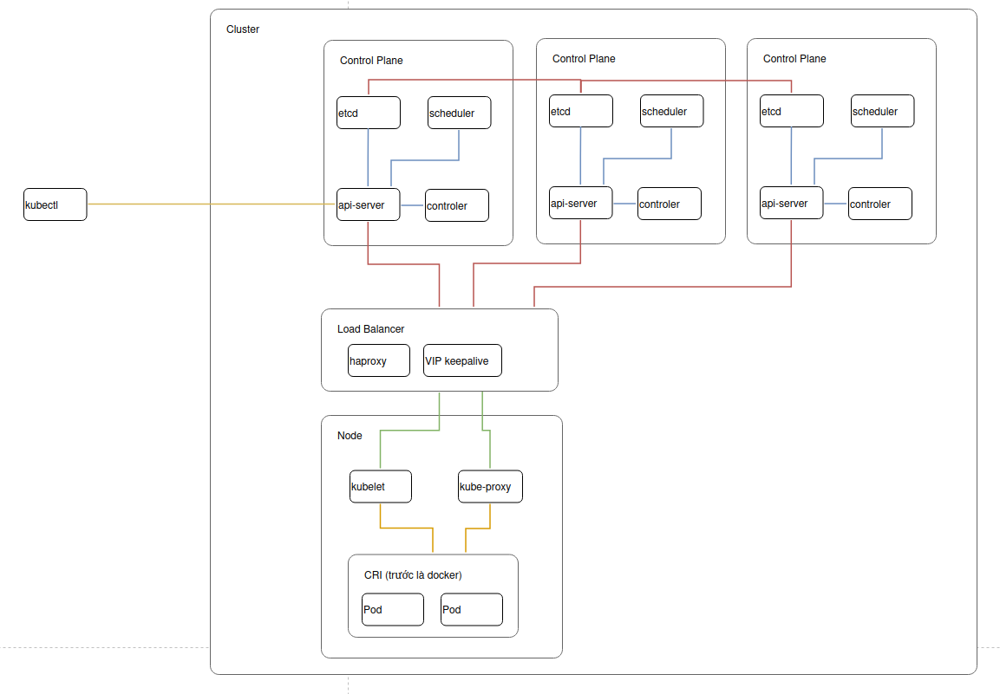
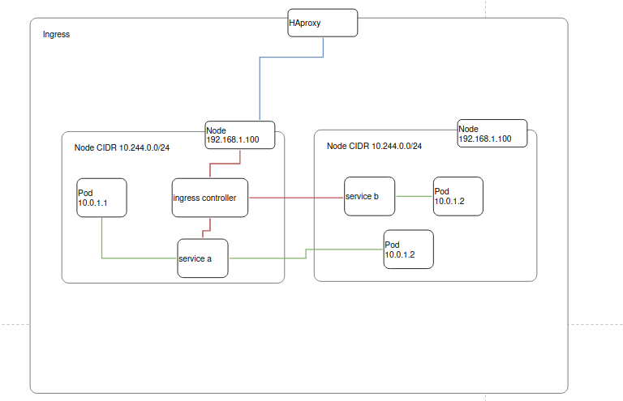
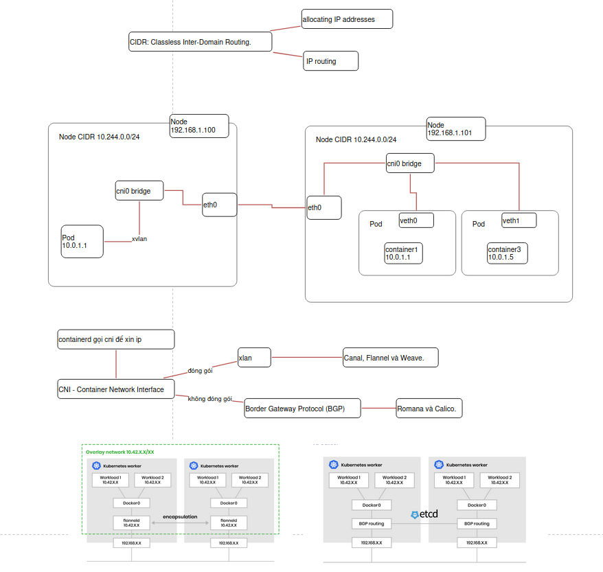

Một số tìm hiểu ban đầu về k8s. 

1. Mối liên hệ giữa containerd và docker




- k8s đang bỏ docker runtime từ bản 1.24
- bỏ k có nghĩa là phải chỉnh lại docker-formatted container
- cả containerd và CRI-O điều có thể chạy docker-formatted và OCI-formatted images, chỉ khác là nó có thể chạy mà không cần dùng đến lệnh docker của docker daemon
- lệnh docker -> crictl (https://vineetcic.medium.com/mapping-from-dockercli-to-crictl-life-after-docker-is-cri-a39ea5649d6c)

```
chỉ có trên crictl
pods(listpod), runp (tun pod), stopp, port-forward
vẫn có các lệnh như
stats, exec (k sp --user)
```

https://vineetcic.medium.com/the-differences-between-docker-containerd-cri-o-and-runc-a93ae4c9fdac

2. Mô hình cài đặt




- nginx là web server 
- haproxy là loadbalancer 
- kong là gateway
- ingress nginx: mô hình thực tế để triển khai chỗ này là như nào nhỉ? làm sao để set được 3 nginx trên 3 node và trỏ haproxy -> chỗ này hình như vào bằng node vật lí nào mà port đó chẳng được. (nguyên tắc của nodeport) -> gẳn thêm 1 con haproxy nữa là ngon rồi




https://itnext.io/kubernetes-ingress-controllers-how-to-choose-the-right-one-part-1-41d3554978d2

https://stackoverflow.com/questions/45079988/ingress-vs-load-balancer

3. mô hình mạng

- kubelet gọi containerd gọi cni (container network interface) để xin ip
- https://ronaknathani.com/blog/2020/08/how-a-kubernetes-pod-gets-an-ip-address/
- https://stackoverflow.com/questions/50781372/ip-addressing-of-pods-in-kubernetes



- khi nào thì cần bind mạng vào ip, khi nào thì cần bind vào 0.0.0.0: khi có nhiều interface mạng -> cần xem có cho đi qua nhiều mạng thì để 0.0.0.0 còn đâu chỉ 1 thì set ip. nó giống việc ip internal với external của thằng kafka

- kube-proxy (optional). If you use a network plugin that implements packet forwarding for Services by itself, and providing equivalent behavior to kube-proxy, then you do not need to run kube-proxy on the nodes in your cluster
- https://kubernetes.io/docs/concepts/architecture/#kube-proxy