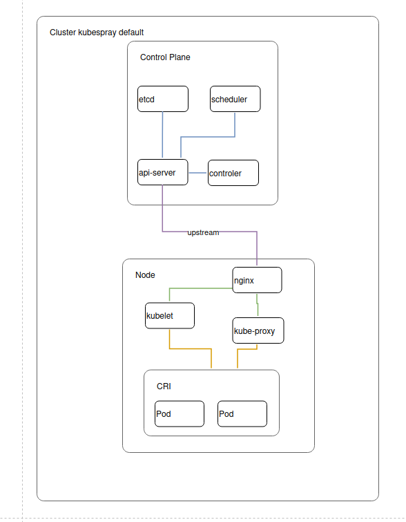
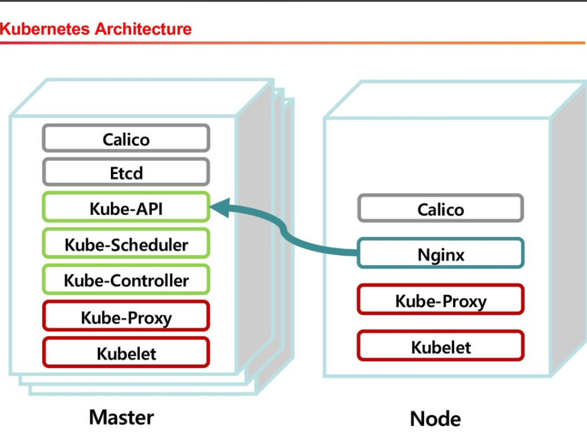

- nếu cài bằng kubesprray thì mặc định nó sẽ HA api-server bằng nginx 
https://github.com/kubernetes-sigs/kubespray/blob/master/docs/operations/ha-mode.md

https://speakerdeck.com/seungkyua/building-kubernetes-infra-using-kubespray?slide=3

