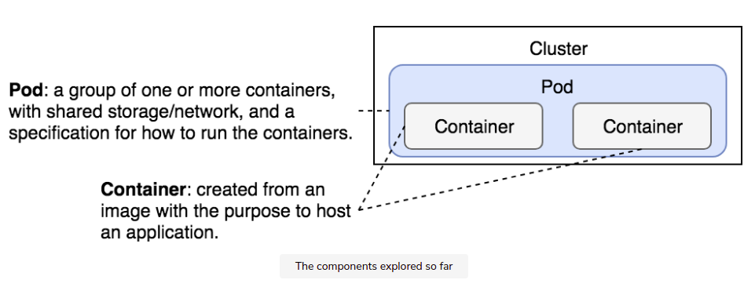
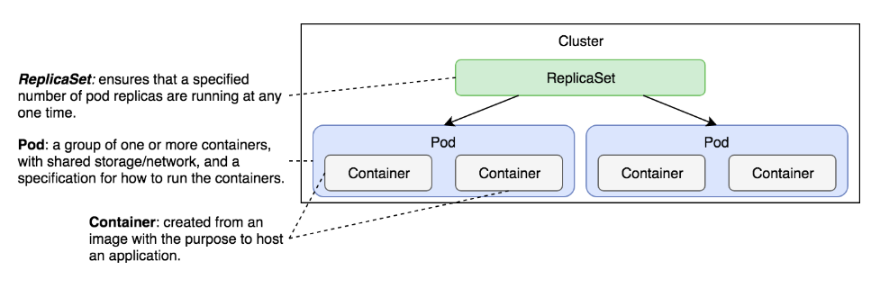
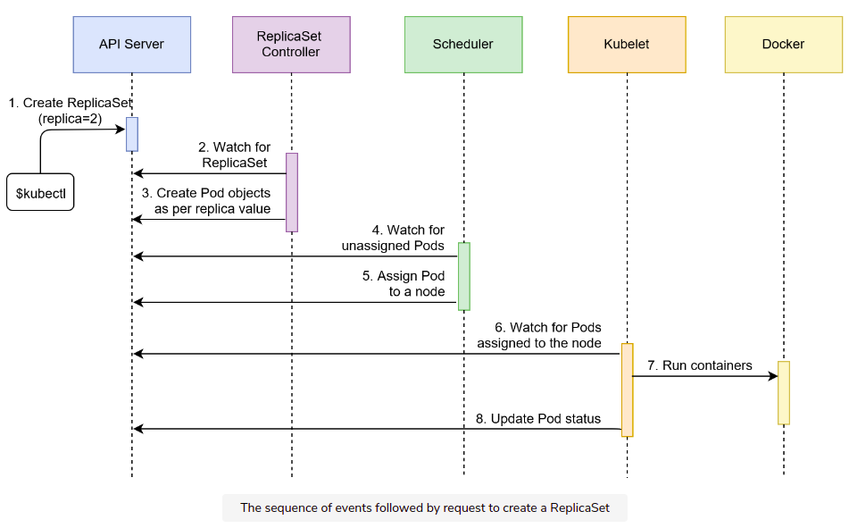

# Replica

- pod 


- pod with replica



- scale pod 
- pod not fault tolerant
- cái **controller** đầu tiên mình học đây là **ReplicaSet**
- hỗ trợ selector 
- miễn là đủ resource thì nó sẽ đảm bảo số replica này 

# How to use 
- kind : Pod -> PeplicaSet

- run 
```
kubectl create -f go-demo-2-scaled.yml
```

- check rs 
```
kubectl get rs
kubectl get pods --show-labels
```

- test xóa pod -> tự chạy lại 
```
watch -n 1 kubectl get all -o wide
kubectl delete pod/go-demo-2-5jph7 
```

- test đổi nhãn pod -> pod bị đổi nhãn vẫn chạy và + 1 pod do rs tạo thêm

- test đổi nhãn về cũ -> tự động xóa cho đủ 4 

- xóa rs mà k xóa pod 
```
kubectl delete -f rs/go-demo-2.yml \
    --cascade=false
```

- update : cho phép sửa file rồi update
```
kubectl apply -f go-demo-2-scaled.yml
```


# Flow 

- kubectl -> call API server  
- scheduler watch API server -> chọn node đặt pod -> call API server 
- kubelet watch API server -> run pod 



# Note 
- chọn không phân biệt có phải là pod trong file này init không. tức là trong file bắt chạy 2, bên ngoài mình call tay chạy 1 cái rồi thì Replica +1 nữa cho đủ thôi 
- nếu có nhiều hơn thì cx bị terminate 
- một khi định nghĩa k8s thì bắt buộc cần ít nhất 3 thành phần 
```
apiVersion , kind, metadata
```