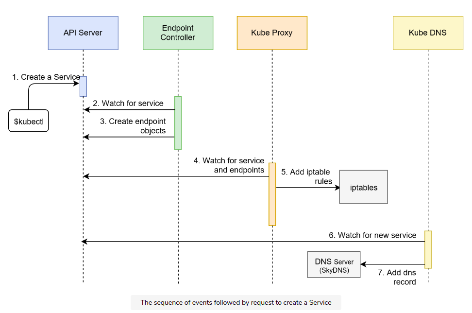
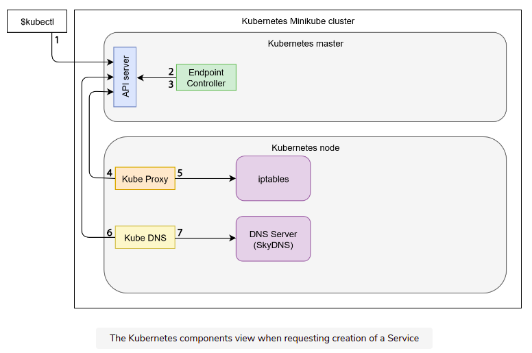
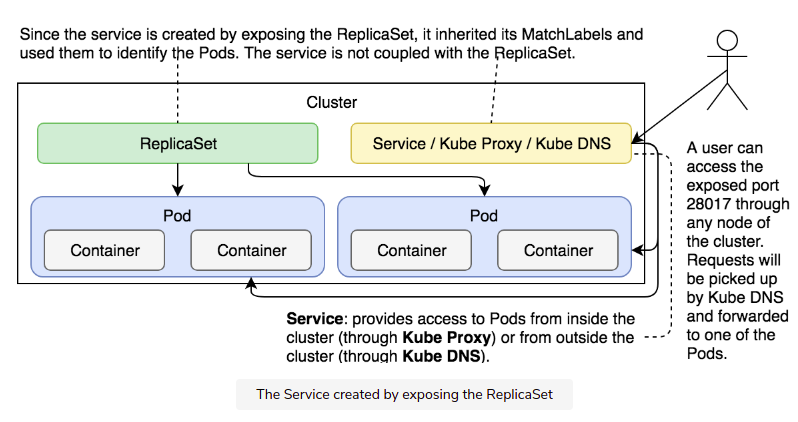
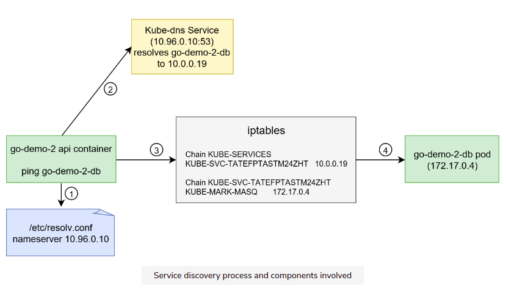

# Service 

- cần giao tiếp các pod 
- khi một pod chết mà chạy lại bởi rs thì có thể nó sẽ được cho một ip mới 
- k8s cung cấp một địa chỉ mà qua đó pod có thể giao tiếp với nhau 


# Expose port 

- cmd 
```
kubectl expose rs go-demo-2 \
    --name=go-demo-2-svc \
    --target-port=28017 \
    --type=NodePort
```

- ngoài ra, có các services 
```
ClusterIP : call nội bộ giữa các pod và chặn bên ngoài (now)
LoadBalancer (cloud sau)
ExternalName : service -> external addr (ít dùng)
```

# Cluster ip 



- kubectl call create service 

- Endpoint Controller watch service -> trả về endpoint 

- kube proxy watch 2 thứ là service và endpoint  -> add iptable 

- kube dns watch service thôi và add DNS 


- trên là flow, còn hình sau là những gì xảy ra trong cụm 



# Command

- tạo như bthg 

```
kubectl create -f  go-demo-2-svc.yml
```

- xem service 
```
kubectl describe svc go-demo-2 
```

- ví dụ 
```
Type:                    NodePort
IP:                      10.0.0.194
Port:                    <unset>  28017/TCP
TargetPort:              28017/TCP # Port với targetPort này thường mặc định giống nhau. đây là cổng mà mọi pod trong cluster có thể vô 
NodePort:                 <unset>  31879/TCP  # bên ngoài cluster
Endpoints:               172.17.0.4:28017,172.17.0.5:28017
Session Affinity:        None
External Traffic Policy: Cluster
Events:                  <none>
```

- khả năng truy nhập 




# note 

- call vô thì có nhiều pod có thể nhận -> random và đảm bảo các pod nhận các req tương đương nhau. vẫn có các cách khác như hash, queue ... 


# Discovery Service 

- chạy lênh sau để lấy ra ENV cảu 1 pod
```
kubectl exec pod/go-demo-2-api-8ckl8 env 
```

- nó sẽ in ra những biến môi trường , một số là do image config, một số là cấu hình do k8s thiết lập 

- chạy lệnh sau để lấy thông tin về svc mà pod đó thuộc về 
```
kubectl describe svc go-demo-2-api
```

- ta có thể thấy trường ip nó được set ở 2 th này có giống nhau 

- cuối cùng là tác dụng của dns, thay vì viết ip hoặc lấy biến môi trường giống ở trên thì : 
```
env:
- name: DB
  value: go-demo-2-db  # tên service -> ip bởi dns 
```

- flow : pod1 call pod2 -> pod1 lấy ra địa chỉ dns server -> call dns server -> lấy về ip cho pod2 -> call iptable(có cơ chể  load balance) -> call pod2 



# Q&A

- một pod chết -> chạy lại pod khác sẽ có thể k còn là ip cũ 
- NodePort -> mặc định chạy ClusterIP