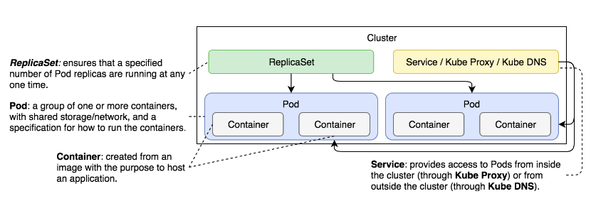
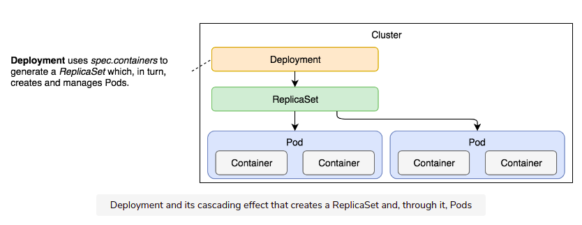
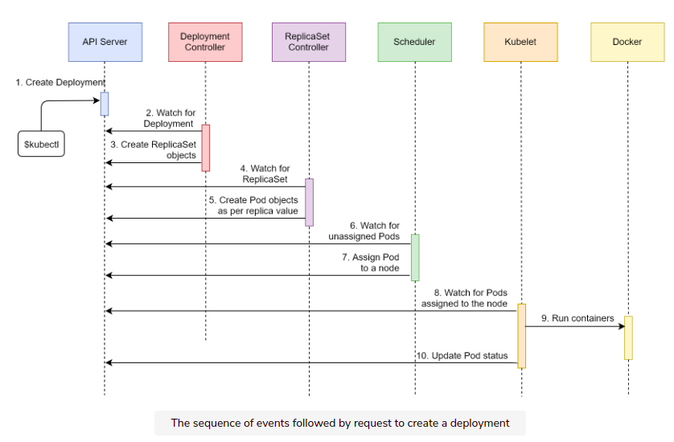
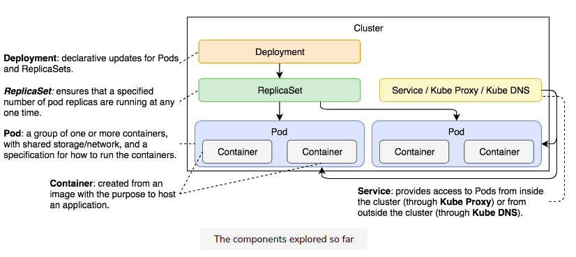

# Here We Go 


- cho đến phần này ta đã được tim hiều về : 



# Deploy 

- luôn thay đổi ->  cần cập nhật liên tục 
- zezo down time 
- kind : Deployment
- tạo thêm deployment controler 
```
kubectl get all
pod 
service/
deployment.apps/
replicaset.apps/
```

# Flow 

- overview qua 


- flow call tạo 


# Note 

- mấy cái có chung deploy thì có 1 id đầu giống nhau thì phải. chugn với cả trong replicaset nữa 
- nếu update nhiều cái trong một lệnh ```set``` thì thêm dấu , thôi thì phải 
- lệnh để update gồm 2 lệnh kubectl set image và kubectl edit
- nhớ là recreate thfi kill all mới update 
- database change -> rolling forward 

# Tổng kết 

