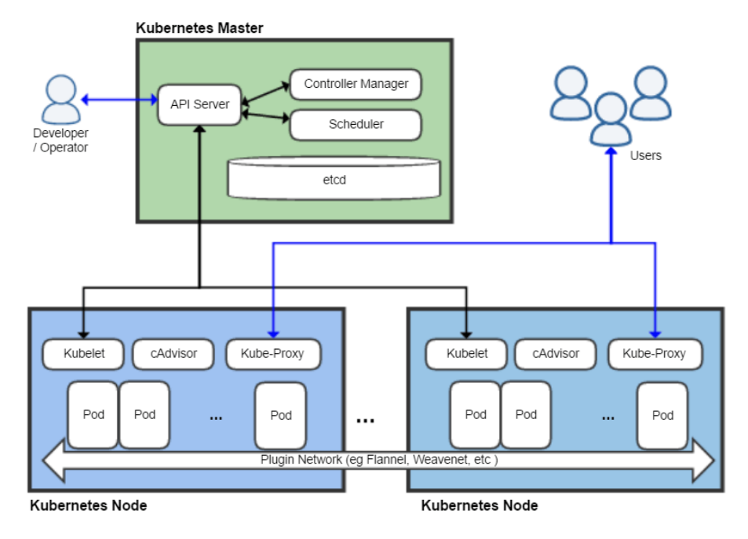

# hello-k8s
kubernetes 

# Overview 

# Vagrant 

# Cluster k8s

# Minikube 

# scan with gitleaks

long@hello:~/Documents/hello-k8s$ sudo apt install gitleaks 
long@hello:~/Documents/hello-k8s$ gitleaks detect --source . -v 